# ShowUP Local — How the Content Writer Works

> A code-level walkthrough of the page generation engine (`POST /generate-page` in `services/nlp/main.py`).
> Companion to `docs/PRD_MIGRATION.md`. Reflects the live implementation, not the idealized design.

---

## 1. What the writer is

The writer is a single FastAPI endpoint — `POST /generate-page` — that takes a business + a keyword and **streams back a finished, publish-ready HTML page**. It is not a "write me an article" prompt. The core design philosophy:

> **Don't ask the LLM to be good at SEO. Compute exactly what the page must contain, hand the model the exact strings and placements, then verify the result deterministically.**

Claude Sonnet 4.6 does the *writing*; Python does the *strategy* and the *grading*. It runs as a **Server-Sent Events (SSE) stream** so the frontend gets live progress (`5% → 95%`) over a long-lived request — which is why generation bypasses any short-timeout serverless proxy.

---

## 2. Inputs (`GeneratePageRequest`)

- **Business / GBP data:** name, category, address, phone, website, hours, GBP description
- **Target:** primary keyword, full location string (e.g. `"Anaheim, California, United States"`)
- **Optional enrichments:** `differentiators` (claim + mechanism), `reviews` (GBP review objects), `brand_voice` profile, `detected_icp` profile
- **`serp_analysis`:** cached competitor analysis — if absent, computed inline

---

## 3. The pipeline, step by step

Everything runs inside one async `_worker` that emits progress events to an SSE queue.

### Step 0 — Auth & credit deduction (`progress 5%`)
- `X-API-Key` header → trusted proxy, credits already handled upstream.
- User JWT → **deducts 2 credits** up front (`_deduct_credits_direct(..., 2, ...)`). Insufficient balance → HTTP `402`.

### Step 1 — SERP / competitor analysis (`10% → 50%`)
If no `serp_analysis` was supplied, runs the full analysis inline (`_run_serp_analysis`):
DataForSEO top-10 URLs → domain blocklist filter → ScrapeOwl concurrent scrape → BeautifulSoup zone parsing (`title / h1 / h2_h3 / body / paragraphs`) → TF-IDF related keywords per zone → quadgrams from `<p>` tags → Google NLP entities (salience + page spread). This is the **signal set** that drives everything downstream. On failure, generation continues degraded.

### Step 2 — Scrape the business's own website for facts (`~55%`)
The factual-accuracy backbone. Fetches homepage **+ up to 3 key subpages** (links containing `about`, `service`, `certif`, `team`, `staff`, `credential`, …), concurrently, within an **8,000-character budget**. Tiered fetch: ScrapeOwl no-JS → ScrapeOwl JS (Wix/Squarespace/Webflow) → direct httpx. Extracted text (certifications, license numbers, service areas, team credentials) is injected so the model asserts **real** facts.

> If scraping yields nothing, the prompt is told *explicitly*: "credentials were NOT available — flag these as content gaps," instead of letting the model invent them.

### Step 3 — Assemble context blocks
- **Differentiators** — "use these, include the mechanism for each"
- **Reviews** — filtered to `rating ≥ 4`, max 5, "use verbatim in Section 7, do NOT fabricate"
- **Brand voice** — current voice unless the user explicitly accepted a recommended one
- **ICP profile** — detailed segment / demographic / messaging block
- **Website content** + **SERP context**

### Step 4 — Build the SEO checklist (`60%`) — the targeting engine
`_build_seo_checklist()` turns the scoring rubric + SERP data + business data into an explicit, data-filled instruction list. It computes:

- **Geo entities** — `LOCATION`-type entities found across competitor pages (real neighborhoods/districts), filtering out the target city, state, and country-level terms; capped at 15. More reliable than the model's training knowledge.
- **ZIP codes** — looked up for the city (`_fetch_zip_codes_for_city`).
- **Street reference** — parsed from the business address.
- **FAQ suggestions** — competitor headings that are phrased as questions.

It then emits per-engine requirements with **exact values**, e.g.:

- `<title> must contain "{keyword}" and "{city}"`
- `Neighborhoods to mention (use ≥2): {real list}`
- `ZIP codes — embed ≥3 in visible body text: {list}`
- `FAQ: 4–7 entries EXACTLY … ≥2 proximity FAQs`
- Per-zone keyword/entity targets (`Title: include ≥N of: …`)
- **Quadgrams: "include these EXACT phrases verbatim — do NOT paraphrase"**
- A dedicated **SERP SIGNAL COVERAGE** block: *"⚠ scored by EXACT SUBSTRING MATCHING in Python — paraphrasing does NOT count."*

It also enforces a **distribution rule**: geo signals must be spread across Sections 6, 10, and 12 — not bunched in one place.

### Step 5 — Assemble user prompt + call Claude (`65%`)
User prompt = business data + all context blocks + the checklist. Sent with:
- **Model:** `claude-sonnet-4-6`, `max_tokens=16000`
- **System prompt:** `_GEN_SYSTEM_PROMPT`, sent with `cache_control: ephemeral` (cached → ~10% input cost on hits)
- **Rate limit:** 5 requests/minute

The system prompt governs the writing: 14 AEO/structural rules (answer-first; one idea per `<p>`; question-format H3s; outcome-first bullets; numbered lists for processes; tables only when comparative; entity triplets in ≥3 sections; sections ≤300 words; phone in sections 1/4/8/11; ICP-matched CTA tone) + the **title formula** + the **factual-accuracy constraint** (never invent response times, certs, pricing, years, team size).

### Step 6 — Parse the output
The raw blob is split deterministically:
1. Strip ```` ``` ```` fences.
2. Extract `<title>…</title>` → `page_title`.
3. Extract `CONTENT_GAPS_REPORT_START … END` → parse JSON → `content_gaps`.
4. Split on `<script type="application/ld+json">` → before = `content_html`, script = `schema_json`.

### Step 7 — Post-process the HTML
- `_linkify_phones()` — wraps phone numbers in `tel:` links.
- `_apply_rdfa_markup()` — injects RDFa entity markup using Google NLP entities.

### Step 8 — Score it (`90%`)
Runs **one** scoring pass (`_score_html_inline`), retrying up to 3× only on *transient API errors* (1s, 2s backoff). First-pass generation **does not loop-and-rewrite**: structural requirements are already guaranteed by the checklist + prompt, so any remaining shortfall is a *business-data gap* that retrying can't fix — those go into `content_gaps`. (The iterative rewrite loop lives in the separate **reoptimize** / Improve path.)

### Step 9 — Stream the result (`95% → done`)
Emits the `done` event; the frontend saves the payload to `generated_pages`.

---

## 4. Scoring model (what the score means)

8 engines. Seven graded by Claude Sonnet against a rubric; one pure Python.

- **`_compute_serp_signal_coverage` (15%, deterministic):** re-parses the page into the same zones and does **exact lowercase substring matching** of competitor keywords (30% of this engine), Google entities (50%), quadgrams (20%). Found/missing lists become concrete recommendations. Reproducible, free, exact — which is *why* the checklist drills exact strings into exact zones.
- **7 LLM engines (85%):** organic_ranking, gbp_maps, entity_establishment, icp_alignment, aeo_llm_retrieval, geographic_legitimacy, nearme_intent — each returns `{score, issues, recommendations}`.

Weighted composite → status label (`90+ excellent`, `80–89 good`, `70–79 needs_improvement`, `60–69 below_standard`, `<60 fail`).

---

## 5. Output (`done` event)

```json
{
  "content_html": "<article>…full page…</article>",
  "schema_json": "<script type=\"application/ld+json\">…3 schema blocks…</script>",
  "page_title": "Trusted! emergency plumber anaheim | …",
  "composite_score": 92.4,
  "content_gaps": [
    { "category": "Response Time", "missing": "Specific arrival window",
      "score_impact": "high", "why_important": "...", "how_to_add": "..." }
  ],
  "token_usage": { "model": "...", "input_tokens": 0, "output_tokens": 0, "cost_usd": 0 },
  "cost_breakdown": { "dataforseo": 0, "scrapeowl": 0, "google_nlp": 0, "claude": 0, "total": 0 },
  "serp_analysis": { "…": "…" }
}
```

The HTML is the **13-section page**: intro/hero (keyword + city + differentiator + phone above the fold) → USP → optional offers → CTA → features/benefits → main service body with sub-service H2/H3s → testimonials (only if ≥2 qualifying GBP reviews, verbatim) → secondary CTA → getting-started steps → local/geo block (neighborhoods + landmark + streets + ZIPs) → urgency CTA → FAQ (4–7 entries) → JSON-LD (LocalBusiness + Service + FAQPage).

---

## 6. Why it works — three stacked layers

| Layer | Does | Why it matters |
|---|---|---|
| **Deterministic checklist** (Python) | Computes exact targets from real competitor data | The model never guesses what to optimize for |
| **System prompt** (Claude) | Enforces structure, tone, factual honesty | Turns targets into well-written, AEO-friendly prose |
| **Deterministic scorer** (Python) | Exact-match verifies coverage per zone | The 15% engine can't be fooled by paraphrase — precise, free, reproducible gap list |

**Honesty mechanism:** anything the model can't verify from GBP/website data is *not invented* — it's pushed into the **Content Gaps report** ("how to reach 100/100"), which the user acts on to improve the page on a later run.

---

## 7. Pipeline flow diagram

```mermaid
flowchart TD
    A["POST /generate-page<br/>(SSE stream)"] --> B{Auth}
    B -->|X-API-Key| C[Trusted proxy<br/>credits handled upstream]
    B -->|User JWT| D[Deduct 2 credits<br/>402 if insufficient]
    C --> E
    D --> E["Step 1: SERP analysis<br/>(inline if not cached)"]

    subgraph SERP["SERP / competitor analysis"]
      E --> E1[DataForSEO top-10 URLs]
      E1 --> E2[Domain blocklist filter]
      E2 --> E3[ScrapeOwl concurrent scrape]
      E3 --> E4["BeautifulSoup zone parse<br/>title / h1 / h2_h3 / body / paragraphs"]
      E4 --> E5[TF-IDF related keywords per zone]
      E5 --> E6["Quadgrams from &lt;p&gt; tags"]
      E6 --> E7["Google NLP entities<br/>(salience + page spread)"]
    end

    E7 --> F["Step 2: Scrape business website<br/>homepage + 3 subpages, 8k char budget<br/>(real facts: certs, licenses, areas)"]
    F --> G["Step 3: Context blocks<br/>differentiators · reviews(&ge;4&#9733;) · brand voice · ICP"]
    G --> H["Step 4: _build_seo_checklist()<br/>exact targets: keyword/entity per zone,<br/>ZIPs, neighborhoods, quadgrams,<br/>FAQ count, distribution rules"]

    H --> I["Step 5: Assemble user prompt<br/>+ cached _GEN_SYSTEM_PROMPT<br/>(14 AEO rules + title formula +<br/>factual-accuracy constraint)"]
    I --> J["Claude Sonnet 4.6<br/>max_tokens 16000"]

    J --> K["Step 6: Parse output<br/>title · content_gaps · content_html · schema_json"]
    K --> L["Step 7: Post-process HTML<br/>linkify phones + RDFa entity markup"]
    L --> M["Step 8: Score (single pass)<br/>_score_html_inline"]

    subgraph SCORE["8-engine composite score"]
      M --> M1["7 LLM engines (85%)<br/>Claude Sonnet rubric"]
      M --> M2["serp_signal_coverage (15%)<br/>DETERMINISTIC exact-substring match<br/>keywords 30% · entities 50% · quadgrams 20%"]
    end

    M1 --> N
    M2 --> N["Step 9: SSE done event<br/>content_html · schema_json · page_title ·<br/>composite_score · content_gaps · cost_breakdown"]
    N --> O[(Frontend saves to<br/>generated_pages)]

    style SERP fill:#eef7ff,stroke:#3b82f6
    style SCORE fill:#fef6ee,stroke:#f59e0b
    style M2 fill:#fff3cd,stroke:#f59e0b
    style H fill:#e7f9ee,stroke:#10b981
```


